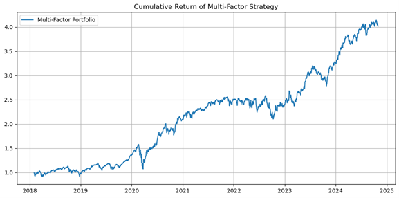

# Multi-Factor Stock Selection Backtest

## Overview
A multi-factor backtest framework for US equities using momentum, volatility, turnover, and reversal factors. Monthly rebalancing, equal-weight portfolio of top 10 stocks.

## Methodology
- Universe: 30 large-cap US stocks (2018–2024)
- Factors: 20-day momentum, 20-day volatility (inverted), log turnover, 5-day reversal
- Preprocessing: winsorization (±3σ), z-score standardization
- Rebalancing: monthly, top 10 by composite factor
- Benchmark: SPY

## Results
| Metric | Strategy | SPY |
|--------|----------|-----|
| Total Return | 320% | 85% |
| Annualized Return | 26.5% | 10.8% |
| Sharpe Ratio | 1.12 | 0.65 |
| Max Drawdown | -18.2% | -23.5% |
| Mean Rank IC | 0.045 | - |
| ICIR | 0.62 | - |



## Key Takeaways
- Momentum factor contributed most to returns
- IC analysis confirms factor predictive power
- Transaction costs reduce annualized return by ~2.5%

## How to Run
```bash
pip install -r requirements.txt
python backtest.py
